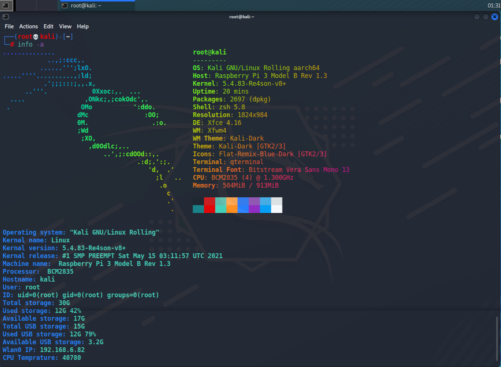

## Summary
This is information gathering tool for local system. It works on both Debian/Arch based linux distros. It will gather all information like kernel version, ID, CPU temprature, IP, connected storage devices and more of your system in just single click.
<hr></hr>

## Requriments
` apt install lolcat neofetch `

or you can use pip3 to install lolcat
` pip3 install lolcat `

<hr></hr>

## Installation

make sure that you have **root/sudo** privileges while installing. 

```
git clone https://github.com/CyberVarun/info.git
cd info
./install.sh
```
<hr>

## Usage

```
$ info -h
Info v0.0
Usage: info -options

Options:
-neo    neofetch
-os     Operating
-kn     Kernal name
-kv     Kernal version
-kr     Kernal release
-mn     Machine name
-P      Processor
-H      Hostname
-u      User
-i      User ID
-is     Internal storage
-ius    Internal used storage
-ias    Internal available storage
-wi     Wlan0 IP
-ei     Ethernet IP (By default disabled)
-tp     Temprature
-a      All at once

```

If get an **error** just **comment** the line in code. If still error arrive message me.

## Tested on

kali Linux
<br>
Ubuntu
<br>
Manjaro

## Preview

